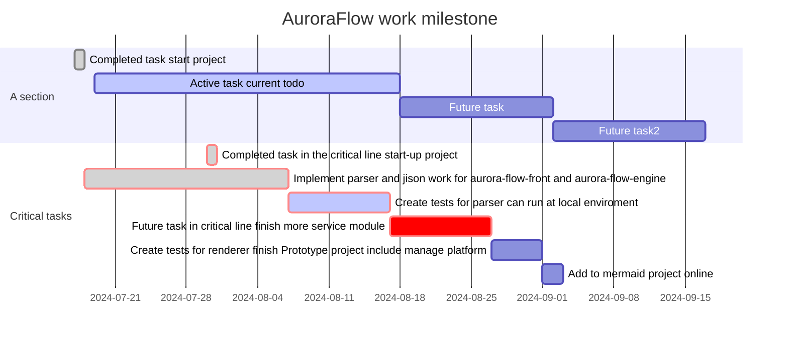

## Hi there 👋

<!--

**Here are some ideas to get you started:**

🙋‍♀️ A short introduction - what is your organization all about?
🌈 Contribution guidelines - how can the community get involved?
👩‍💻 Useful resources - where can the community find your docs? Is there anything else the community should know?
🍿 Fun facts - what does your team eat for breakfast?
🧙 Remember, you can do mighty things with the power of [Markdown](https://docs.github.com/github/writing-on-github/getting-started-with-writing-and-formatting-on-github/basic-writing-and-formatting-syntax)
-->

路虽远，行则将至，事虽难，做则必成！！！

welcome to auroraflow tech 

|仓库名|说明|状态|进度|时间|扩展|
|-|-|-|-|-|-|
|[保密-商业文档](https://github.com/AuroraFlowLab/business-document)|项目计划书等|todo|进行中|2024-07-17|负责人-排期|
|[技术调研](https://github.com/AuroraFlowLab/aurora-flow-tech-research)|相关技术调研AI/K8S.etc|todo|规划中|2024-07-17|负责人-排期|
|[aurora前端项目](https://github.com/AuroraFlowLab/aurora-flow-front)|前端项目,PC/H5/小程序|todo|规划中|2024-07-17|排期|
|[aurora后端engine服务](https://github.com/AuroraFlowLab/aurora-flow-engine)|engine core service|todo|规划中|2024-07-17|排期|
|[aurora后端管理平台](https://github.com/AuroraFlowLab/aurora-flow-manage)| manage platform|todo|规划中|2024-07-18|排期|
|[aurora管理平台前端](https://github.com/AuroraFlowLab/aurora-flow-manage-front)|manage platform front|todo|规划中|2024-07-18|排期|

-------------------------------------------
## 里程碑

